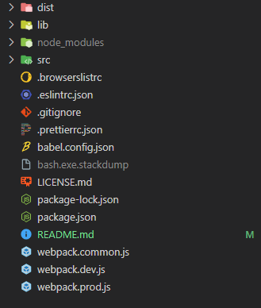
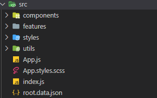

# Fibonacci Numbers Calculator - Technical Documentation

## Introduction

Welcome to the technical documentation for the Fibonacci Numbers Calculator web application. This simple app allows users to calculate Fibonacci numbers based on their input. It is designed as a one-page app and provides a straightforward user experience. This document will guide you through the installation, usage, and troubleshooting of the application.

## Features

The Fibonacci Numbers Calculator offers the following features:

-   Input: Users can type a number in a designated field.
-   Output: The app performs the necessary calculations and displays the corresponding Fibonacci number.

## Usage

To use the Fibonacci Numbers Calculator, follow these steps:

1. Open the app in a web browser.
2. Enter a number in the provided field.
3. Press the "Calculate" button.
4. The Fibonacci number corresponding to the input will be displayed on the screen.

## File Structure

The file structure of the Fibonacci Numbers Calculator is organized as follows:

-   **_src/_**: The folder containing the source code of the Fibonacci Numbers Calculator.
-   **_dist/_**: The folder containing the distributed code of the Fibonacci Numbers Calculator. This folder typically contains minified and optimized versions of the source code for deployment.
-   **_lib/_**: The folder containing the polyfilled code of the Fibonacci Numbers Calculator. This folder may include additional dependencies or polyfills to ensure compatibility with older browsers or environments.

The src folder of the Fibonacci Numbers Calculator contains the following files and folders:

-   **_index.js_**: This file serves as the entry point for the application.
-   **_App.js_**: The App.js file houses the main component of the application. It is responsible for managing the overall structure and behavior of the app.
-   **_components folder_**: This folder contains various components that make up the views and user interface of the app. Each component represents a specific part of the App view and contributes to the functionality of the application.
-   **_features folder_**: Within this folder, you will find additional files that represent specific features of the Fibonacci Numbers Calculator. These files implement functionalities such as input handling, calculation logic, and displaying the Fibonacci number.
-   **_styles folder_**: This folder contains additional CSS or styling files that customize the visual appearance of the application. It includes styles specific to the Fibonacci Numbers Calculator.
-   **_utils folder_**: The utils folder holds various helper functions that assist in the implementation of the application's functionality. These functions provide reusable code snippets and utilities for performing calculations or other operations.

## Troubleshooting

If you encounter any issues while using the Fibonacci Numbers Calculator, try the following troubleshooting steps:

-   Ensure that you have entered a valid number in the input field.
-   Check for any error messages displayed on the console of your web browser's developer tools.
-   Verify that all the necessary dependencies are installed by running npm install in the project directory.

## License

The Fibonacci Numbers Calculator is released under the GNU General Public License. For more details, please see the [LICENSE file](./LICENSE.md).

Hope you find the Fibonacci Numbers Calculator helpful and enjoy using it! If you have any feedback or suggestions, please don't hesitate to reach out to us.
